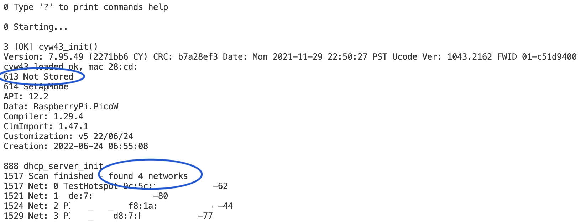
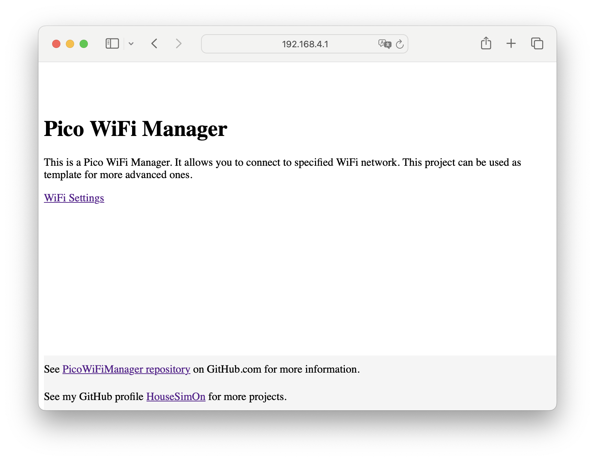
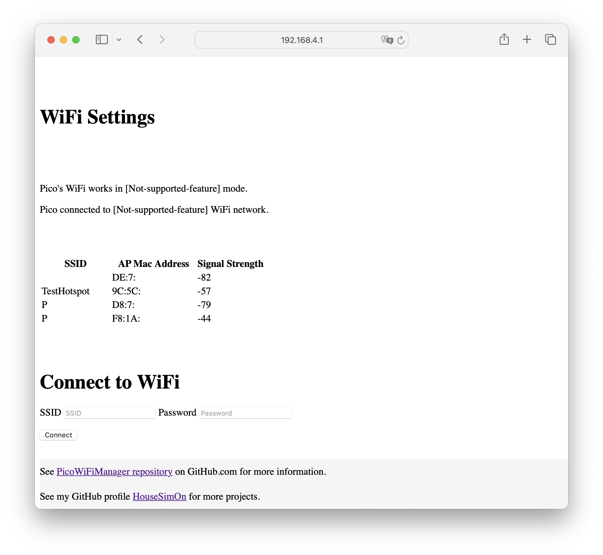

[](https://github.com/HouseSimOn/PicoWifiManager/actions/workflows/build_cmake.yml)

# Pico Wifi Manager
WiFi Manager for Pico W.

List of features:

- WiFiManager allows you to connect to the AP created by PicoW and specify WiFi SSID and password of network that Pico should connect to.
- PicoW hosts WebPage with a form to connect to WiFi. The page presents also list of available WiFi networks.
- When credentials are set using WebPage, Pico connects to WiFi STA.
- Passed WiFi credentials are stored in Flash memory - credentials are used after next reset to connect to the selected network.
- It is possible to send commands using eg. minicom to erase flash with credentials or start scanning of WiFi networks.

## How to use it?

1. Build project - see build steps in [build workflow](.github/workflows/build_cmake.yml).
2. Program Pico and run `minicom`.
3. You should see output similar to the following screen:
    

    This output says that credentials are not stored in flash memory, so PicoW starts in AP mode. WiFi networks scan results are listed on the end of screen.

> [!NOTE]
> MAC addresses and Network names are hidden.

4. In `minicom` type `?` to see help for commands:

    ```
    ___Command Help___
    '?' - to printf this help
    'e' - to erase stored data by WiFiManager
    's' - to perform Wifi scan
    ```

    Type `e` or `s` to perform action.

5. Pico created WiFi AP with SSID: `PicoWiFiManager`. Connect to this network using `12345678` password on your PC or smartphone.

    In `minicom` you should see similar output to the:
    ```
    DHCPS: client connected: MAC=74:a6:XX:XX:XX:XX IP=192.168.4.16
    ```

    There is MAC address of connected device (eg. your PC) and assigned IP for this device by DHCP on Pico.

6. On your device open WebBrowser and go to the address: `192.168.4.1`.

    You should see main page:
    

7. Click on **WiFi Settings** and you will be redirect to the following page:

    

> [!NOTE]
> On the page you can find list of found WiFi networks.

8. Type SSID and password of WiFi network you want to connect to and click on Connect button. Then in minicom you should see similar output to:

```
16784 Received params: ssid, password.
20768 IP Address: 192.168.43.131
```

It is information that Pico has successfully connected to the network and has IP: `192.168.43.131`.

9. Now, you can connect your device to the same network and open `192.168.43.131` address in your browser. You should see the same page from point 6.

10. Now, after restart you will see that credentials are stored and Pico will try to connect to the stored network. You will be informed about assigned IP.

## Repository template
Repository created based on [this template](https://github.com/HouseSimOn/PicoSdkStartTemplate) in version __0.0.1__.

## SDK Documentation
https://raspberrypi.github.io/pico-sdk-doxygen/modules.html

## Setup

Platform: Ubuntu

1. Clone repository.
2. Call `git submodule update --init` in the main directory and then go to the pico-sdk and call this command again. (or `git submodule update --init --recursive`)

### printf - via USB
1. To CMakeLists.txt add following lines:
    ```
    pico_enable_stdio_usb(WifiManager 1)
    pico_enable_stdio_uart(WifiManager 0)
    ```
2. Find connected device: `ls -l /dev/ttyUSB* /dev/ttyACM*`
3. Start minicom: `sudo minicom -b 115200 -o -D /dev/ttyACM0` 

### USB Logger - macOS

1. Find Pico device
    ```
    ls /dev/tty.usb* 
    ```
2. Run screen application
    ```
    screen /dev/tty.usbmodem1101 115200
    ```
3. Run `minicom`
    ```
    minicom -D /dev/tty.usbmodem1101 -b 115200
    ```

### `picotool` usage

1. Load .uf2 file to Pico board
    ```
    picotool load -v -x WifiManager.uf2 -f    
    ```

2. Reboot Pico board
    ```
    picotool reboot -f  
    ```